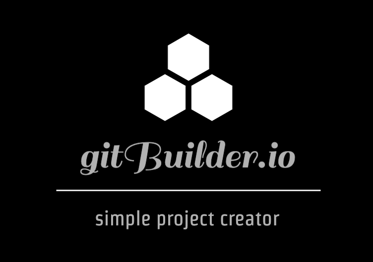

<p align="center">
  <a href="" rel="noopener">
 </a>
</p>

<div align="center">

[]()
[](https://travis-ci.com/github/SystemFiles/gitbuilder-io)
[](/LICENSE)

</div>

---

<p align="center"> A simple, easy-to-use Git project builder (ONYL supports GitHub currently)
    <br> 
</p>

## 📝 Table of Contents

- [About](#about)
- [Getting Started](#getting_started)
- [Usage](#usage)
- [Authors](#authors)

## 🧐 About <a name = "about"></a>

gitBuilder.io is a simple CLI tool that I believe everyone should have installed on their dev machines. This tool, with it's extensible templates library, allows developers to get up and running very quickly and without all the boring environment and repository setup. gitBuilder.io will start by asking you a couple of basic questions about your project and then will give you a detailed breakdown of how it is building your project the entire way through. After your project is built, you are presented with all the details of your project and the location of your project on Github. At this point, you are ready to start coding! Just like that 🏎💨

## 🏁 Getting Started <a name = "getting_started"></a>

If you would like to help out by adding your own templates or possibly some new features to the project, you can follow these steps.

### Clone the project

You'll need to close the project to start working on it

```
git clone https://github.com/SystemFiles/gitbuilder-io.git
```

### Prerequisites

First you will need to install a few things if you don't have them already.

```
Node
NPM
```

### Installing

To install project dependencies you need only one command

```
npm install
```

## 🎈 Usage <a name="usage"></a>

If you would like to download this tool for your own use, you may to so by downloading the package globally from NPM

```
npm install -g gitbuilder-io
```

## ✍️ Authors <a name = "authors"></a>

- [@SystemFiles](https://github.com/systemfiles)
